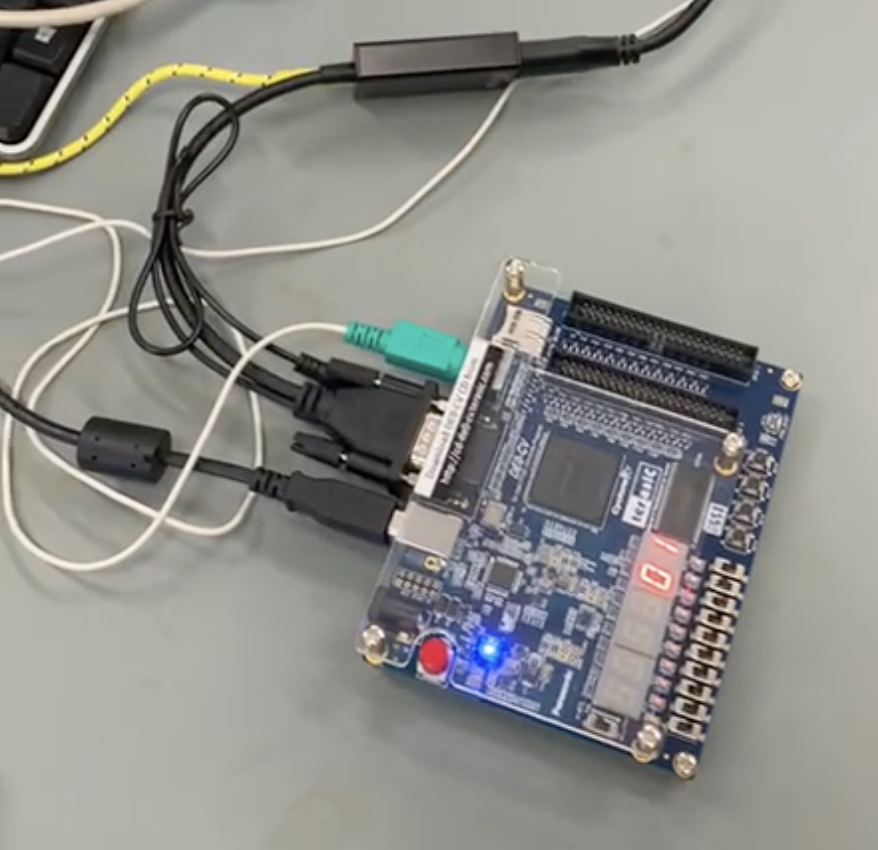

# Flappy Bird - VHDL
An implementation of flappy bird in vhdl for an FPGA. Uses a PS/2 mouse to control the character and navigate through menus, and displays picture through a VGA cable.

## Gallery

### The Hardware

### The Menu

### The Game
